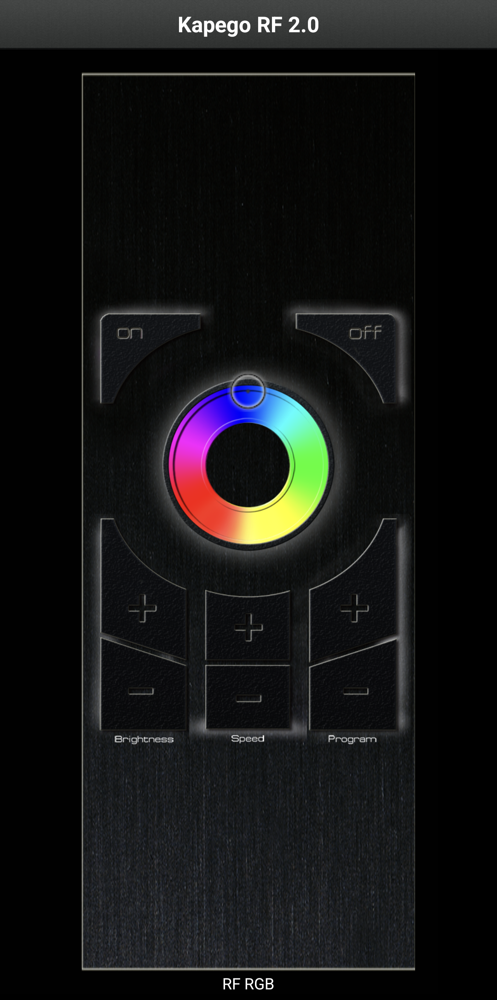
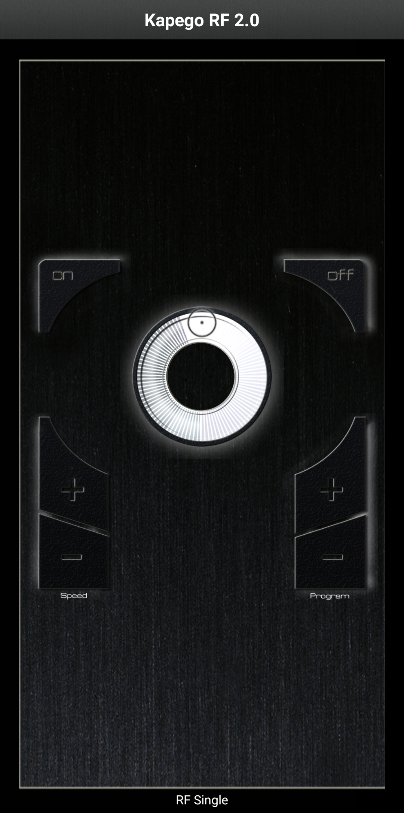

Home Assistant Kapego|Chat Status|
=================================================================================

Open source home automation that puts local control and privacy first. Powered by a worldwide community of tinkerers and DIY enthusiasts. Perfect to run on a Raspberry Pi or a local server.

Check out `home-assistant.io <https://home-assistant.io>`__ for `a
demo <https://demo.home-assistant.io>`__, `installation instructions <https://home-assistant.io/getting-started/>`__,
`tutorials <https://home-assistant.io/getting-started/automation/>`__ and `documentation <https://home-assistant.io/docs/>`__.

This project
---------------------

Integration of Kapego/Dekolight controllers for Home Assistant.
Bases on UPD Packets beeing sent to the controller of "Shanghai Flying Electronics".

All of the protocol figured out by "reverse engineering" (the controller traffic is sent using unencrypted UDP).

Available Controller Types
--------------------------

.. csv-table::
    :header: ,|SINGLE|, |WHITE|, |RGB|, |RGBW|

    "ON",           |Y|, |Y|, |Y|, |Y| "B "
    "OFF",          |Y|, |Y|, |Y|, |Y| "A "
    "COLOR",        |N|, |N|, |Y|, |Y| "@<num>"
    "WHITE +",      |N|, |Y|, |N|, |Y| "C "
    "WHITE -",      |N|, |Y|, |N|, |Y| "I "
    "BRIGHTNESS +", (|Y|), |Y|, |Y|, |Y| "D "
    "BRIGHTNESS -", (|Y|), |Y|, |Y|, |Y| "E "
    "SPEED +",      |Y|, |Y|, |Y|, |Y| "G "
    "SPEED -",      |Y|, |Y|, |Y|, |Y| "H "
    "PROGRAM +",    |Y|, |Y|, |Y|, |Y| "J "
    "PROGRAM -",    |Y|, |Y|, |Y|, |Y| "K "

.. |Chat Status| image:: https://img.shields.io/discord/330944238910963714.svg
   :target: https://www.home-assistant.io/join-chat/

.. |Y| image:: https://img.icons8.com/?size=25&id=VFaz7MkjAiu0&format=png&color=000000
.. |N| image:: https://img.icons8.com/?size=25&id=OZuepOQd0omj&format=png&color=000000
